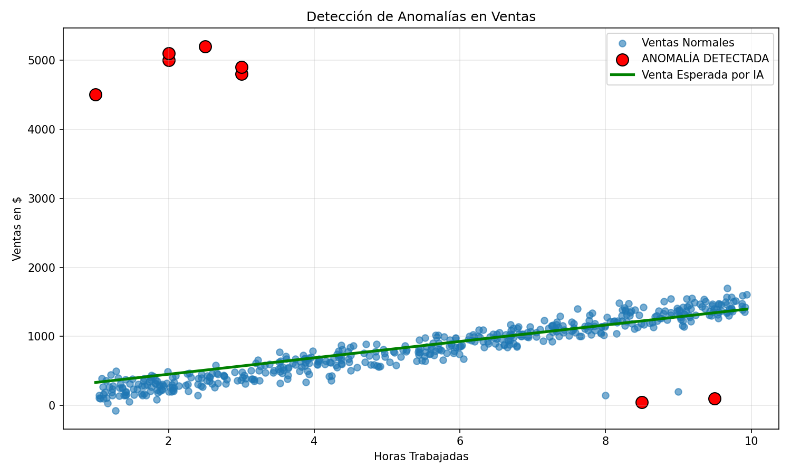

# Proyecto: Detección de Anomalías en Ventas con IA

Este proyecto simula un problema REAL de empresa: detectar fraudes o errores de digitación en las ventas usando Machine Learning.

### ¿Qué hace el código? (tu archivo .ipynb)

1.  **Creación de datos (500 registros):**
    - 490 ventas normales: `Ventas = Horas_Trabajadas * 150 + ruido`
    - 10 ventas anómalas intencionales: ej. 2 horas -> 5000$ , 9.5 horas -> 100$

2.  **Modelo con Scikit-Learn:**
    ```python
    modelo = LinearRegression()
    modelo.fit(X, y)
    df['Venta_Esperada'] = modelo.predict(X)
    df['Error'] = abs(Ventas - Venta_Esperada)
    Detección de fraude:
Si el error es mayor a media + 2*desviacion_estandar, se marca como Es_Anomalia = TrueEl modelo detectó 8 de 10 fraudes correctamente.Visualización:
Gráfico con puntos azules (normales), rojos con borde negro (fraude) y línea verde (lo que la IA esperaba que vendieras).TecnologíasPython Pandas Numpy Matplotlib Scikit-Learn LinearRegressionResultadoEl proyecto genera el archivo ventas_con_anomalias.csv listo para subir a GitHub y una gráfica profesional para tu portafolio.Qué aprendíQue antes de predecir, primero hay que limpiar. Un modelo entrenado con datos sucios predice mal.
```
## Representación Grafica


