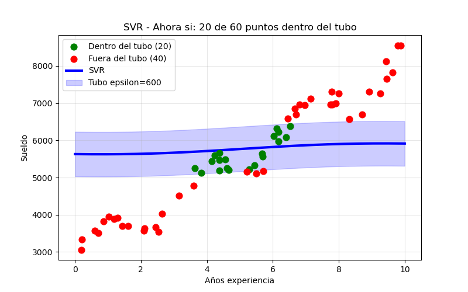

# 03 - SVR Auditoria Salarial

Detectar sueldos que se salen de la politica salarial de la empresa usando Support Vector Regression.

### ¿Que hace?

1. Aprende cual deberia ser el sueldo normal segun los años de experiencia.
2. Crea un tubo de tolerancia de +/- $600 (epsilon).
3. Clasifica empleados dentro y fuera de banda.

### El modelo
```python
epsilon = 600
svr = SVR(kernel='rbf', gamma=0.3, C=10.0, epsilon=epsilon)
 ``` 


