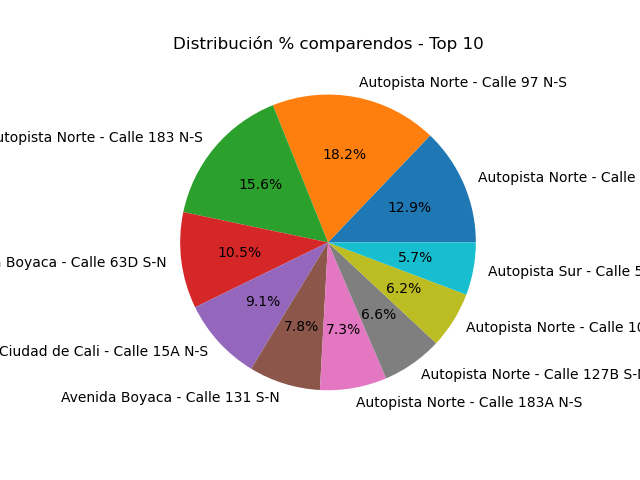

# 🚦 Proyecto Cámaras de Fotodetección Bogotá - Análisis de Riesgo con IA

**Análisis con datos reales del Ministerio de Transporte / ANSV**
Fuente oficial: [https://fotodeteccion.ansv.gov.co/ubicaciones-aprobadas.html](https://fotodeteccion.ansv.gov.co/ubicaciones-aprobadas.html)

Proyecto académico para el Concejo de Bogotá - Top 10 cámaras con más comparendos 2025.

### 📊 ¿Qué hace este programa?
Entrena un modelo de **Árbol de Decisión y Random Forest** para predecir el nivel de riesgo de una cámara (ALTO / MEDIO / BAJO) basado en características de la vía.


### 📥 Origen de los Datos
Dataset `camaras_top_bogota.csv` construido a partir de:
1.  Listado oficial de ubicaciones aprobadas por la **ANSV (Agencia Nacional de Seguridad Vial)**.
2.  Informe del **Concejo de Bogotá 2025** con promedio de comparendos mensuales.

Características usadas:
- `limite_kmh`: Dato oficial ANSV
- `es_norte`: Variable derivada de la localidad (Usaquén/Chapinero = 1)
- `nivel_riesgo`: Variable objetivo creada a partir de comparendos (ALTO >=3000, MEDIO >=1800, BAJO <1800)

### ⚠️ Limitación y Nota Legal del Dataset

> La información utilizada en este proyecto está sujeta estrictamente a lo que permite descargar la entidad gubernamental (ANSV / MinTransporte) en su portal público.

> Hubiese sido ideal incluir la variable **HORA** en que más se registran las multas para un análisis de hora pico, sin embargo, aunque esta información reposa en el **SIMIT y en la Secretaría Distrital de Movilidad**, **no es de consulta libre y abierta**.

> Dicha información debe ser solicitada de forma individual mediante **Derecho de Petición** (Ley 1755 de 2015), por lo que no pudo ser integrada en esta fase del proyecto.

**Propuesta Fase 2:** Cruzar este dataset con datos SIMIT obtenidos por Derecho de Petición para incluir variables `hora`, `es_hora_pico`, `dia_semana`.

### 🤖 Hallazgo del Modelo
Con datos actuales:feature  importancia
es_norte          1.0
limite_kmh        0.0javascriptEl modelo determina que el factor geográfico es el determinante del riesgo de comparendo.

### ▶️ Cómo ejecutar

```bash
pip install pandas scikit-learn matplotlib
python main.py

### Resultado Grafico




